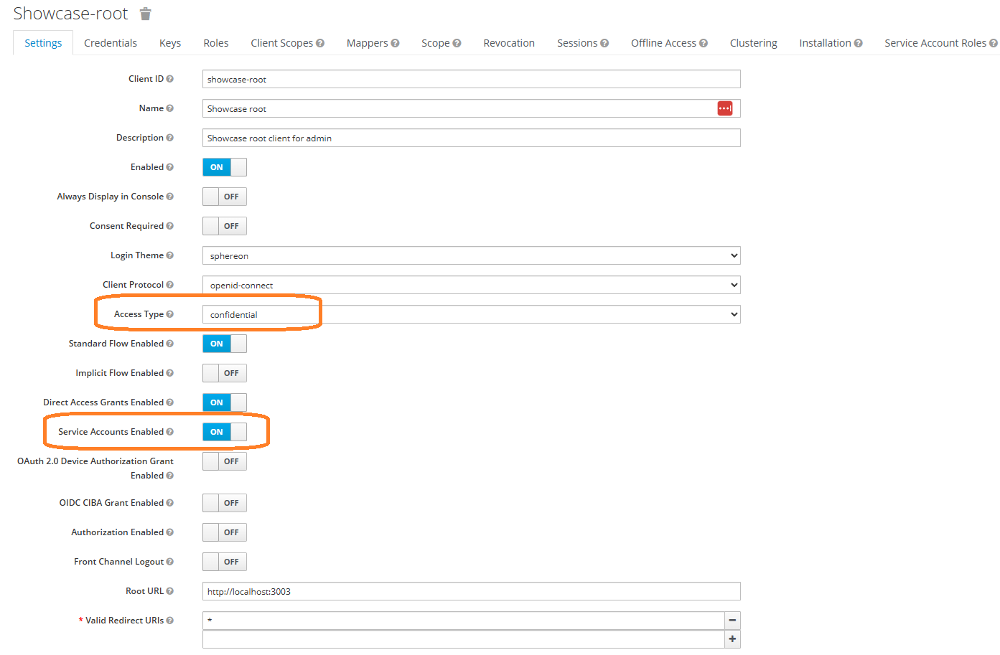
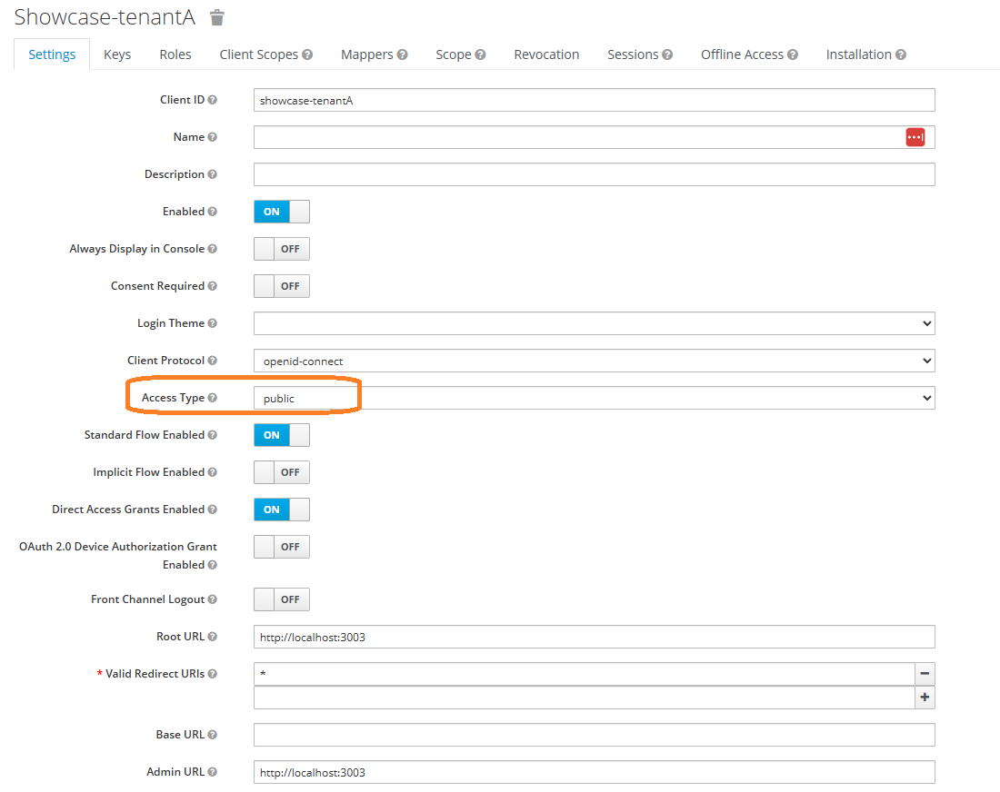

# Root tenant

For tenant management and token introspection we have a separate client which is configured in the API server module.  
   
\* Redirect URLs and origins must match the hostname URL patterns of the deployed environment

In this example, the client id, which maps to environment var OIDC_ROOT_CLIENT_ID is “showcase-root”  
The access type is confidential and “Service Accounts Enabled” has to be enabled. The client secret OIDC_ROOT_CLIENT_SECRET will be revealed under the tab “Credentials”.  
This client id & secret can be used to create new tenant records in the database.

# Showcase builder UI tenants

Showcase builder front-end tenants should be of type public. For write / update / delete operations the API server will use its own client (showcase-root) to introspect the token created by the public client on the Keycloak server to validate it’s integrity, issuer origin and whether the user has logged out his session in the meantime.

\* Redirect URLs and origins must match the hostname URL patterns of the deployed environment
