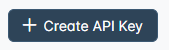
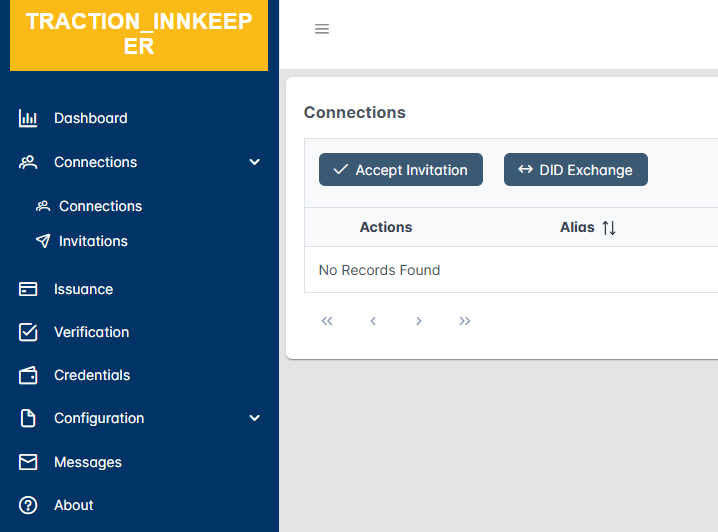

Here are the steps to start a local traction environment using docker compose.

git clone https://github.com/bcgov/traction.git (or use Project from version control)

Go to ./scripts and copy .env-example to .env

Open the .env and set the following vars
- POSTGRESQL_PORT
- ENDORSER_POSTGRESQL_PORT
- ENDORSER_ACAPY_ADMIN_CONFIG=--admin-insecure-mode   # Uncomment

When using ngrok, set the auth token
- NGROK_AUTHTOKEN

When NOT using ngrok, and have your own DNS hostnames & reverse proxy
- TRACTION_ENV=notLocal
- TRACTION_ACAPY_ADMIN_URL=https://your-ngrok-admin-for.example.com   (use your own hostname for the admin)
- ACAPY_ENDPOINT=https://your-ngrok-agent-for.example.com  (use your own hostname for the agent)

When NOT using ngrok, open docker-compose.yml to line
- ACAPY_LOG_LEVEL=${ACAPY_LOG_LEVEL}
  (line 44 at time of writing) And add above or below
- ACAPY_ENDPOINT=${ACAPY_ENDPOINT}

Open a terminal / shell in ./scripts and execute


````shell
docker compose pull
docker compose build
docker compose up -d
````
(docker compose up -d directly will work if executed a second time after errors)

When all containers are up you can access the swagger docs on URL http://localhost:8032/api/doc . (Also on https://<external-host>/api/doc )
http://localhost:8032/api/docs/swagger.json will show the swagger.json


## Tenant UI

Open http://localhost:5101/innkeeper, log in with innkeeper / change-me
Open “API Keys“ →




Take note of your key.

Open http://localhost:5101
Go to tab “API Key“, log in with innkeeper and the API key you just created

This will take you to a simple UI




## Testing the simple flow

See https://github.com/bcgov/traction/tree/main/scripts#simple-flow

This will take you to the point where you can start calling API endpoints using a Bearer token.
In my case I could skip steps 2 & 3, possibly due to the “--admin-insecure-mode“ config option.
